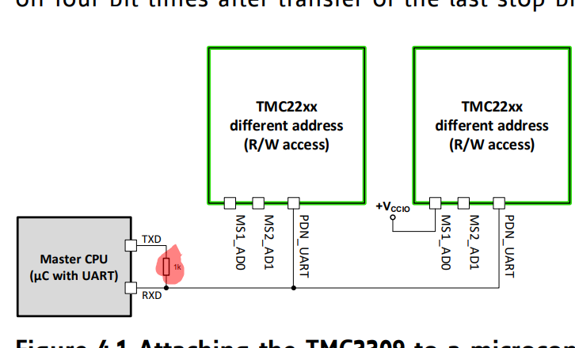

# Upute za korištenje

Cilj projekta je pokretanje Stepper motora uz pomoć TMC2209 drivera u svrhu pomicanja montirane multispektralne kamere.

Korišten je Raspberry Pi Model B+ i Model 3 uz Raspberry Pi OS. Konekcija sa računalom je preko ethernet kabla. 

## Software setup:

U svrhu pokretanja TMC2209 drivera korišten je premade library ["TMC_2209_Raspberry_Pi"](https://github.com/Chr157i4n/TMC2209_Raspberry_Pi).

Potrebno je omogućiti serijsku komunikaciju jer driver i uređaj komuniciraju preko UART-a:

```bash
sudo raspi-config
```

### Instalacija:

Klonirati repozitorij na RP: 

```bash
git clone https://github.com/Chr157i4n/TMC2209_Raspberry_Pi
```

Sve skripte su pokrenute na Pyton 3X verziji po principu:

```bash
sudo python3 skripta.py
```

Potrebno je skinuti i python modul "Bitstring":

```bash
pip3 install bitstring
```

Pošto se modul instalira na "/home/pi/.local/lib/python..."" a skripte rade samo uz pokretanje kao "root user" uz "sudo python3 skripta.py", dolazi do problema prilikom pokretanja. Zaobilazak je aktivacija virtualnog okruženja te pokretanje skripte nakon instalacije modula tamo:

```bash
source env-ftp/bin/activate
```

## Hardware setup:

### Potrebna oprema:

1. Raspberry PI + napajanje

2. TMC2209 driver

3. Stepper motor

4. Breadboard + kablovi

5. Napajanje 12/24 V za pokretanje samog motora.

6. 1k Ohm otpornik za uspostavu dvosmjerne UART komunikacije Rx/Tx.


### Dijagram povezivanja:


TMC2209 je driver koji ima jedan izlaz za UART konekciju te preko njega provodi slanje i čitanje podataka. Potrebno je PD_UART pin direktno povezati sa RP Rx pinom, te preko 1k Ohmnog otpornika sa Tx pinom kao što je vidljivo iz [Trinamic dokumentacije](https://www.trinamic.com/fileadmin/assets/Products/ICs_Documents/TMC2209_Datasheet_rev1.06.pdf) : 




